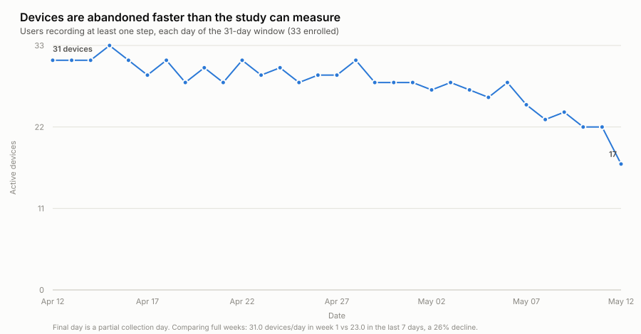
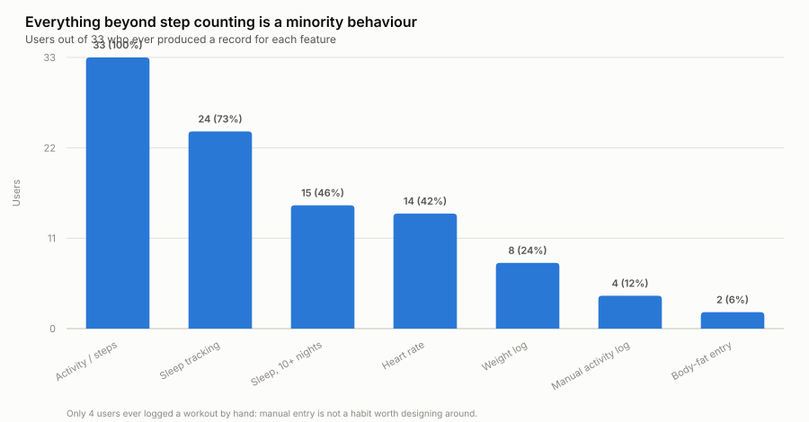
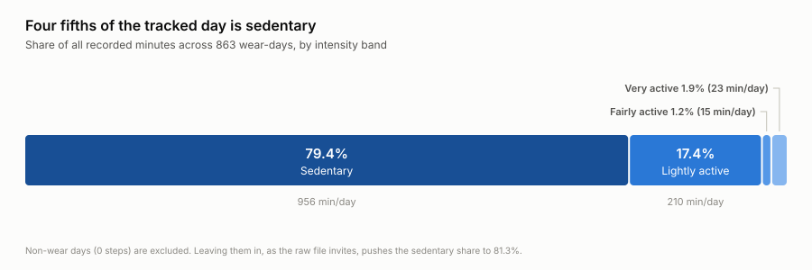
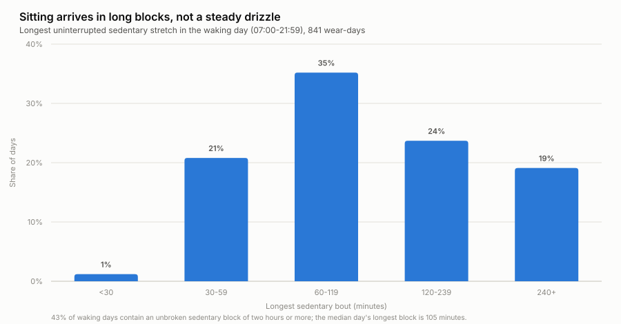
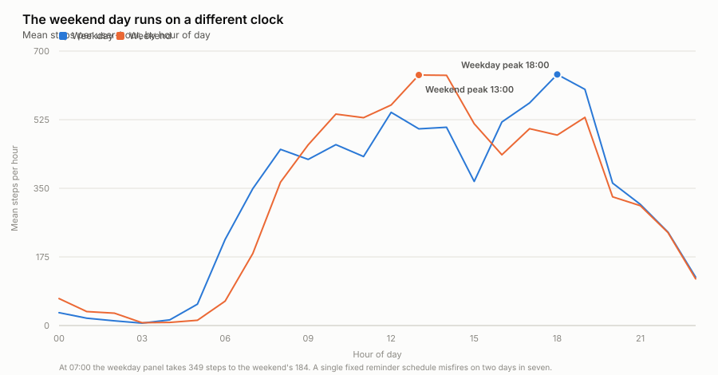

# Bellabeat Case Study — High-level recommendations to improve health-related apps

Google Data Analytics Certificate capstone. An analysis of 18 Fitbit tracker datasets
(33 users, 31 days, ~5.5 million rows) asking how a wellness technology company should
change its product and its marketing.

**Business task:** deliver high-level recommendations about smart-device usage trends to
inform Bellabeat's marketing strategy.
**Stakeholders:** Bellabeat executive team.
**Tools:** originally Excel, Google Sheets and R; re-analysed here in Python (pandas).

| | |
|---|---|
| **Recommendations** | **[RECOMMENDATIONS.md](RECOMMENDATIONS.md)** — the deliverable |
| Original report | [docs/bellabeat-capstone-report.pdf](docs/bellabeat-capstone-report.pdf) — full Ask/Prepare/Process/Analyse/Act write-up |
| Data | [data/](data/) — 18 CSVs organised by time grain, [dictionary](docs/DATA_DICTIONARY.md) |
| Caveats | [docs/DATA_QUALITY.md](docs/DATA_QUALITY.md) — read before quoting any number |
| Code | [analysis/](analysis/) — four scripts that reproduce every figure and table |

---

## Headline findings

### 1. Devices are abandoned faster than the study can measure

<picture>
  <source media="(prefers-color-scheme: dark)" srcset="outputs/figures/01-daily-active-devices.dark.svg">
  
</picture>

Devices producing at least one step fell from **31 per day in week 1 to 23 per day in
the final week — a 26% decline in a single month**. This is the largest effect in the
dataset, and it is invisible if you only analyse the days people did wear the device.
Retention, not measurement, is the binding constraint.

### 2. Everything beyond step counting is a minority behaviour

<picture>
  <source media="(prefers-color-scheme: dark)" srcset="outputs/figures/02-feature-adoption.dark.svg">
  
</picture>

Step tracking reaches all 33 users. Sleep reaches 24, but only **15 wear the device
overnight habitually**. Weight reaches 8. Only **4 users ever logged a workout by hand**.
Automatic capture produces data; anything requiring the user to remember does not.

### 3. Four fifths of the tracked day is sedentary

<picture>
  <source media="(prefers-color-scheme: dark)" srcset="outputs/figures/05-time-budget.dark.svg">
  
</picture>

Nearly 16 hours a day sedentary, against **38 minutes of moderate-to-vigorous activity**.
Half the panel — 16 of 33 users — averages under 7,500 steps.

### 4. Sitting arrives in long blocks, not a steady drizzle

<picture>
  <source media="(prefers-color-scheme: dark)" srcset="outputs/figures/04-sedentary-bouts.dark.svg">
  
</picture>

The median waking day contains an unbroken sedentary stretch of **105 minutes**, and
**43% of days contain a block of two hours or more**. A daily step goal cannot see this —
but it is exactly what an app can interrupt. The sedentary *bout*, not the daily total,
is the actionable unit.

### 5. The weekend day runs on a different clock

<picture>
  <source media="(prefers-color-scheme: dark)" srcset="outputs/figures/03-hourly-rhythm.dark.svg">
  
</picture>

Weekday activity peaks at **18:00**; weekend activity peaks at **13:00** and starts about
two hours later in the morning. A single fixed reminder schedule is tuned to the weekday
shape and misfires two days in seven.

### 6. Intensity beats volume for calorie burn

Very active minutes explain **11× more variance in daily calorie burn than lightly active
minutes** (R² 0.375 vs 0.033) — and the panel spends 210 minutes a day lightly active
against 23 very active. The scarce input is the one that matters, which inverts the
"I don't have an hour" objection.

---

## What the re-analysis changed

Re-running the case in Python surfaced three results that do not survive checking. They
are documented in full in [docs/DATA_QUALITY.md](docs/DATA_QUALITY.md).

| Claim | Status |
|---|---|
| "Activity peaks on Tuesday, then declines to Monday" | **Calendar artefact.** The 31-day window holds five Tuesdays but four Sundays; ranking by *total* steps ranks by how often a day occurs. Per person-day, Wednesday drops from 2nd to 5th and Saturday ties Tuesday. |
| "81.3% of time is sedentary" | **Inflated to 79.4%.** 72 zero-step days record exactly 1440 sedentary minutes — non-wear encoded as maximum stillness. |
| Sleep ↔ sedentary time, r = −0.60 | **Arithmetic, not behaviour.** Sedentary time ≈ `1440 − sleep − active` by construction. Normalised against awake time, r falls to **−0.088**. |

The last one is the reason there is no "sit less to sleep better" recommendation here,
despite it being the strongest correlation in the daily data.

---

## Repository layout

```
.
├── RECOMMENDATIONS.md          # the deliverable: 9 recommendations + evidence
├── data/                       # 18 raw Kaggle CSVs, grouped by time grain
│   ├── daily/ hourly/ minute/ seconds/ logs/
│   └── README.md               # provenance, licence, file inventory
├── docs/
│   ├── bellabeat-capstone-report.pdf
│   ├── DATA_DICTIONARY.md      # every column, unit and trap
│   └── DATA_QUALITY.md         # what is wrong with the data and what was done
├── analysis/                   # reproducible Python
│   ├── common.py               # loaders + a dependency-free SVG chart builder
│   ├── 01_data_quality.py
│   ├── 02_activity_and_sleep.py
│   ├── 03_intraday_rhythm.py
│   └── 04_figures.py
└── outputs/
    ├── tables/                 # 13 result CSVs
    └── figures/                # 5 figures, light + dark variants
```

## Reproducing the analysis

```bash
git lfs install                 # five data files exceed 40 MiB
git clone <this-repo> && cd <this-repo>
pip install -r requirements.txt

cd analysis
python 01_data_quality.py       # coverage, wear, adoption
python 02_activity_and_sleep.py # segments, weekday, calorie drivers, sleep
python 03_intraday_rhythm.py    # hourly profile + sedentary bouts (~2 min)
python 04_figures.py            # regenerate all 10 SVGs
```

Only pandas and numpy are required. Figures are emitted as hand-built SVG, so there is
no plotting dependency and the charts stay diff-readable in version control.

## Limitations

33 pseudonymous users, 31 days, spring 2016, self-selected through Amazon Mechanical
Turk. **No age, gender, height or location is recorded** — so a case study framed around
women's habits rests on data that cannot identify a single participant as a woman. Every
recommendation is therefore a hypothesis about *tracker users*, with the transfer to
Bellabeat's customers flagged as an assumption. Segment sizes are 7–10 users; treat them
as illustrative rather than as population estimates.

## Data source and licence

Fitbit Fitness Tracker Data, published on [Kaggle](https://www.kaggle.com/datasets/arashnic/fitbit)
by *Mobius* under **CC0 1.0 (public domain)**. The CSVs are the unmodified Kaggle export.
Analysis code in this repository is MIT licensed — see [LICENSE](LICENSE).

---

*Feedback welcome — this was my first data analytics case study, and the re-analysis
above exists because the first pass was worth checking.*
